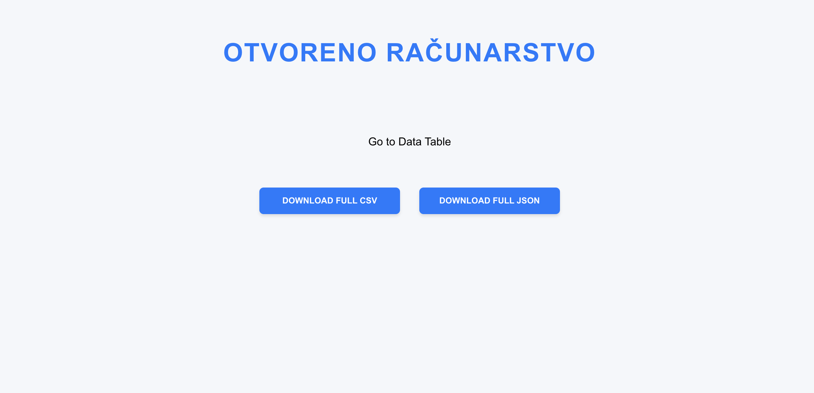

# Laboratorijske vježbe

## Sadržaj

1. [Tema](#tema)
2. [Cilj](#cilj)
3. [Licencija](#licencija)
    - [Opis CC0 1.0 Universal](#opis-cc0-10-universal)
4. [Autor](#autor)
5. [Verzija skupa podataka](#verzija-skupa-podataka)
6. [Jezik skupa podataka](#jezik-skupa-podataka)
7. [Naslov](#naslov)
8. [Datum izrade podataka](#datum-izrade-podataka)
9. [Datum objave podataka](#datum-objave-podataka)
10. [Opis skupa podataka](#opis-skupa-podataka)
    - [1. Club](#1-club)
    - [2. Player](#2-player)
    - [3. Season](#3-season)
11. [Funkcionalni zahtjevi](#funkcionalni-zahtjevi)
12. [O implementaciji](#o-implementaciji)
13. [Tehnologije koristene za implementaciju](#tehnologije-koristene-za-implementaciju)
    - [Frontend](#frontend)
    - [Backend](#backend)
14. [Upute za lokalno testiranje](#upute-za-lokalno-testiranje)
    - [Radno okruzenje](#radno-okruzenje)
    - [Pokretanje projekta](#pokretanje-projekta)
        - [Frontend](#frontend)
        - [Backend](#backend)
15. [Pregled funkcionalnosti](#pregled-funkcionalnosti)
    - [Pocetna stranica](#pocetna-stranica)
    - [Prikaz tablice](#prikaz-tablice)
    - [Mogucnost filtriranja](#mogucnost-filtriranja)
    - [Demonstracija filtriranja](#demonstracija-filtriranja)
    - [Prikaz igraca](#prikaz-igraca)
    - [Uredivanje postavki igraca](#uredivanje-postavki-igraca)
    - [Prikaz kluba](#prikaz-kluba)
    - [Dodavanje novog kluba](#dodavanje-novog-kluba)
    - [Trenutna tablica lige](#trenutna-tablica-lige)
16. [Ostalo](#ostalo)

---
## Tema

Tema laboratorijske vježbe izrada je otvorenog skupa podataka. **Otvoreni podaci** podaci su kojima bilo tko može
slobodno pristupiti, koristiti ih i dijeliti.

---
## Cilj

Cilj prve laboratorijske vježbe je upoznavanje s procesom kreiranja otvorenog skupa podataka te njegovog dijeljenja u obliku javnog
git-repozitorija. Za potrebe prve laboratorijske vježbe potrebno je napraviti skup podataka i spremiti taj skup podataka
u bazu po izboru. Postupak izdvajanja podataka u **CSV** i **JSON** formatu mora biti automatiziran skriptom ili shell naredbom.
U drugoj laboratorijskoj vježbi potrebno je napraviti prikaz podataka u strojnom i ljudski čitljivom obliku. Za prikaz podataka u ljudima čitljivom formatu potrebno je podatke prikazati u obliku HTML tablice koja se zajedno s obrascem za filtriranje i asinkronim pozivom (AJAX) za dohvaćanje podataka. Dodatno je potrebno ostvariti filtriranje podataka po svim vrijednostima. Za potrebe druge laboratorijske vježbe skup podataka obogaćuje se metapodacima u formatu JSON Schema. Treća laboratorijska vježba treba skup otvorenih podataka iz prijašnjih laboratorijskih vježbi izložiti kroz RESTful API. API mora imati GET, POST, PUT i DELETE kranje točke. Dodatno je potrebno olakšati čitljivost mogućnosti API-ja koristeći standard OpenAPI.
U četvtoj laboratorijskoj vježbi potrebno je integrirati vlastitu web-aplikaciju s uslugom Auth0 za Single sign-on. Također, potrebno je napraviti zaštićeni dio aplikacije za dohvaćanje profila prijavljenog korisnika. Konačno,  potrebno je semantički opisati barem dva atributa pojedinačnog resursa iz skupa podataka.

---

## Licencija

Ova laboratorijska vježba licencirana je pod [CC0 1.0 Universal (CC0 1.0)](https://creativecommons.org/publicdomain/zero/1.0/).

### Opis CC0 1.0 Universal

- **Odricanje prava**: Autor se odriče svih svojih prava na ovo djelo širom svijeta. Možete kopirati, modificirati,
  distribuirati i izvoditi djelo, čak i u komercijalne svrhe, bez potrebe za traženjem dozvole.

- **Nema obveze navođenja autora**: Nema potrebe za davanjem zasluga autoru.

- **Bez jamstva**: Ovo djelo se pruža "kako jest", bez ikakvih jamstava. Creative Commons nije odvjetnička tvrtka i ne
  pruža pravne usluge; distribucija ovog dokumenta ne stvara odnos odvjetnik-klijent.

Više informacija na [Creative Commons](https://creativecommons.org/publicdomain/zero/1.0/legalcode).

---

## Autor

**Ivan Smiljanić**

## Verzija skupa podataka

**4.0**

## Jezik skupa podataka

**Engleski**

## Naslov

Francuska prva nogometna liga

## Datum izrade podataka

25. listopada 2024.

## Datum objave podataka

25. listopada 2024.

## Datum zadnjeg ažuriranja

18. siječnja 2025.

---

## Opis skupa podataka

Skup podataka je razvijen u PostgreSQL bazi podataka i obuhvaća informacije o nogometnim klubovima iz prve francuske
lige (Ligue 1).
U ovom skupu podataka pohranjeno je ukupno 18 klubova koji sudjeluju u sezoni **2024./2025**.
Podaci uključuju ključne atribute koji se odnose na klubove, igrače te specifične informacije vezane uz odabranu sezonu.

Skup podataka sadrži tri glavne tablice: **Club**, **Player**, i **Season**, koje su međusobno povezane putem
identifikatora kluba i sezone.

### 1. Club

Prva tablica u skupu podataka označava klub i sastoji se od sljedećih stupaca:

| **Naziv Stupca**    | **Opis**                         |
|---------------------|----------------------------------|
| **clubid**          | Identifikator kluba              |
| **clubname**        | Ime kluba                        |
| **stadium**         | Stadion kluba                    |
| **location**        | Lokacija kluba                   |
| **establishedyear** | Godina nastanka kluba            |
| **manager**         | Trenutni trener                  |
| **leagueposition**  | Pozicija u ligi                  |
| **wins**            | Pobjede                          |
| **losses**          | Porazi                           |
| **totalplayers**    | Ukupan broj registriranih igrača |
| **seasonid**        | Identifikator sezone             |

### 2. Player

Druga tablica u skupu podataka označava igrača te se sastoji od sljedećih stupaca:

| **Naziv Stupca**  | **Opis**             |
|-------------------|----------------------|
| **playerid**      | Identifikator igrača |
| **playername**    | Ime igrača           |
| **position**      | Pozicija igrača      |
| **age**           | Dob igrača           |
| **nationality**   | Nacionalnost         |
| **goalsscored**   | Broj golova          |
| **assists**       | Broj asistencija     |
| **matchesplayed** | Odigrane utakmice    |
| **clubid**        | Identifikator kluba  |
| **salary**        | Plaća igrača         |

### 3. Season

Treća tablica u skupu podataka označava sezonu te se sastoji od sljedećih stupaca:

| **Naziv Stupca** | **Opis**             |
|------------------|----------------------|
| **seasonid**     | Identifikator sezone |
| **seasonyear**   | Godina sezone        |

---

## Funkcionalni zahtjevi

- asinkroni način dohvaćanja sadržaja
- osigurati dostupnost podataka u strojno čitljivom obliku
- prikazane podatke treba dohvatiti iz baze podataka
- mogućnost jednostavnog filtriranja po vrijednostima podataka
- filtrirane podatke potrebno je moći preuzeti u .csv i .json formatu
- korištenje GET metode za dohvat cjelokupnog skupa podataka
- korištenje barem tri dodatne GET metode
- korištenje POST metode
- korištenje PUT metode
- korištenje DELETE metode
- odgovori moraju biti omotani u Response omotač
- aplikacija mora biti otporna na greške i na odgovarajući način vraćati poruke o eventualnim
  iznimkama ili pogreškama
- aplikacija ne smije prestati s radom u slučaju pogreške ili prikazati
  zadane poruke o pogreškama odabranih radnih okvira
- dokumentiranje uporabom specifikacije OpenAPI
- integrirati vlastitu web-aplikaciju s uslugom Auth0 za Single sign-on
- zaštićeni dio aplikacije za dohvaćanje profila prijavljenog korisnika
- semantički opisati barem dva atributa pojedinačnog resursa iz skupa podataka
---
## O implementaciji

Laboratorijska vježba implementirana je pomoću Node.js-a u razvojnom okruženju VSCode. Dodatno, korišten je React
framework za jednostavni prikaz i generiranje HTML-a koji je uređen pomoću CSS-a.
Projekt zahtjeva korištenje i instaliranje potrebnih biblioteka putem naredbe `npm install`. Nakon instaliranja
potrebnih modula, projekt se pokreće putem naredbi `npm start` i `node server.js`.

---
# Tehnologije koristene za implementaciju

<h3>Frontend</h3>
<ul class="horizontal-list">
    <li>
        
        CSS
    </li>
    <li>
        
        HTML5
    </li>
    <li>
    
  </li>
  <li>
    
   Git
  </li>
  <li>
        
         PostgreSQL
    </li>
  <li>
     Visual Studio Code
    
  </li>
</ul>

---
## Upute za lokalno testiranje

### Radno okruzenje

Za radno okruženje koristi se VSCode.

- Kloniranje ili preuzimanje projekta
- Otvaranje projekta unutar VSCode odabirom odgovarajućeg direktorija

### Pokretanje projekta

#### Frontend

- pozicionirati se unutar /frontend direktorija
- upisati naredbu `ls` koja će ispisati sve datoteke i mape koje se nalaze u trenutnom direktoriju
- u slučaju da prethodna naredba nije ispisala `node_modules`, upisati naredbu `npm install`
- pokrenuti aplikaciju pomoću naredbe `npm start`

#### Backend

- pozicionirati se unutar /backend direktorija
- upisati naredbu `ls` koja će ispisati sve datoteke i mape koje se nalaze u trenutnom direktoriju
- u slučaju da prethodna naredba nije ispisala `node_modules`, upisati naredbu `npm install`
- pokrenuti server pomoću naredbe `node server.js`

---
## Pregled funkcionalnosti

### Pocetna stranica

### Prikaz tablice

### Mogucnost filtriranja

### Demonstracija filtriranja

### Prikaz igraca

### Uredivanje postavki igraca

### Prikaz kluba

### Dodavanje novog kluba

### Trenutna tablica lige

---
## Ostalo

Podaci su pohranjeni u **.csv** i **.json** formatu putem shell skripte.
Skripta je napravljena kako bi povukla podatke u odabranim formatima iz baze podataka te se može pokrenuti
naredbom `./script.sh`.
